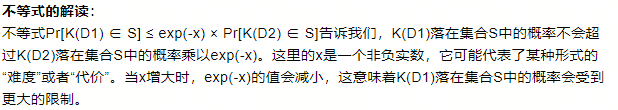

# 什么是差分隐私？
差分隐私（Differential Privacy）是一种*隐私保护技术*，旨在在数据分析过程中平衡数据的可用性和个体隐私的保护。通过在数据集中引入可控的噪声，差分隐私使得针对不同个体的查询结果之间的差异变得模糊和不可靠，从而保护个人隐私。*这种技术允许从数据集中提取有用的统计信息，同时确保个体数据的隐私不被泄露!*

# 常用的环境噪声？
1. 拉普拉斯噪声（Laplace Mechanism）
拉普拉斯噪声是一种广泛应用于数值型数据的差分隐私保护机制。它通过在数据查询结果上添加从拉普拉斯分布中采样的噪声来实现隐私保护。拉普拉斯分布是一种连续概率分布，其概率密度函数具有重尾特性，*适合于保护数值型数据*。拉普拉斯机制的敏感度定义为查询函数输出的最大变化范围，噪声的尺度与敏感度和隐私参数ε成正比
2. 高斯噪声（Gaussian Mechanism）
高斯噪声机制适用于数值型数据，通过在查询结果上添加从高斯分布（正态分布）中采样的噪声来实现隐私保护。与拉普拉斯机制相比，高斯机制在实际应用中可能会提供更小的噪声，从而*在保护隐私的同时减少对数据分析结果的影响*。高斯机制的噪声标准差与隐私参数ε和数据的敏感度有关1。
3. 指数噪声（Exponential Mechanism）
指数机制通常用于非数值型数据，如分类数据。它通过为每个可能的查询结果分配一个概率，并根据这些概率来随机选择一个结果返回。指数机制的关键在于打分函数的设计，该函数*为每个可能的输出结果分配一个分数，分数越高的结果被选中的概率越大*。指数机制通过这种方式在保护隐私和保持数据有用性之间取得平衡

# Differential Privacy A Survey of Results论文笔记
## 如何理解公式一？
这个概率不等式表达的是，在给定的两个数据集D1和D2的情况下，某个事件K(D1)落在集合S中的概率最多是K(D2)落在同一集合S中的概率乘以一个小于1的因子（这里是指数函数e的某个负数次幂，取负数次幂是因为e的负数次幂介于0~1）。

## 关于原点对称的环境噪声的弊端？
环境噪声关于原点对称的特性意味着噪声的分布在正负方向上是相同的。在差分隐私中，这种对称性的噪声通常是指添加到查询结果上的随机噪声，如*高斯噪声或拉普拉斯噪声*。当我们对同一查询进行多次独立尝试并取平均值时，由于噪声的对称性，正向的噪声和负向的噪声在多次查询中会相互抵消，从而使得噪声的总体影响减小，最终得到的结果会更接近真实值。

## 公式二的理解？
公式二是用来定义敏感度的一种形式。用来量化一个函数f对于数据集D的变化可能引起的输出结果的最大变化量。
L1范数是将f(D1)-f(D2)的结果求范数，如果结果为向量，则对每个分量取绝对值并求和。

